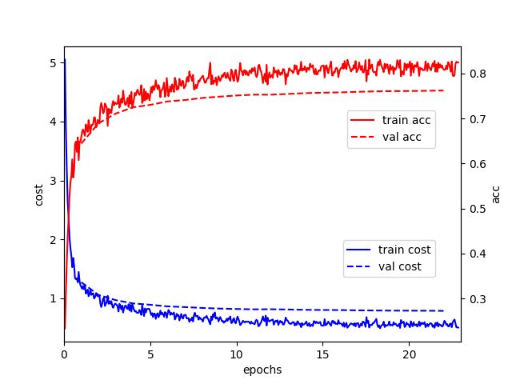

# Google Summer of Coding Week 8

Dear all, this is my 6th blog in this category (Google Summer of Code 2018). This is a short report on my work during Week 8. Different from direct prediction of word distribution using deep learning end-to-end model in DeepSpeech, the example in this blog is closer to the traditional ASR process. I tried to use phoneme as the modeling unit, focusing on the training of the acoustic model in ASR,using Kaldi to extract the features of the audio data and the label alignment, and integrate the decoder of the Kaldi to complete the decoding. Other than the Kaldi work, I also tried to finish the DeepSpeech2 ASR process. However, due to the CPU/GPU problem of the CWRU server, I am not able to manage it.

## 1. Establish an ASR system based on PaddlePaddle and Kaldi

### 1.1 Model Overview

The acoustic model in this example is a multi-layer stacked LSTMP structure. The structure uses convolution to extract the initial features, uses multi-layer LSTMP to model the temperal relation. The loss function is the cross entropy. LSTMP(LSTM with recurrent projection layer) is the extension of the traditional LSTM, adding a mapping layer on the basis of LSTM. The layer maps the hidden layer to a lower dimension and goes into the next time step. The structure also reduces the size and computation complexity of LSTM, at the same time improves the performance of LSTM.

<figure>

<figcaption>Fig.1 Structure Diagram of LSTMP</figcaption>
</figure>

### 1.2 Installation

**Kaldi**

The decoder of the example depends on Kaldi, install it by flowing its [intructions](https://github.com/kaldi-asr/kaldi).Then set the environment variable `KALDI_ROOT`:

export KALDI_ROOT=<Installation path of kaldi>


**Decoder**


git clone https://github.com/PaddlePaddle/models.git
cd models/fluid/DeepASR/decoder
sh setup.sh


### 1.3 Data Preprocessing
Refer to the [data preparation process of Kaldi](http://kaldi-asr.org/doc/data_prep.html) to complete the feature extraction and label alignment of audio data.

### 1.4 Demo
This section takes the Aishell dataset as an example to show how to complete data preprocessing and decoding output. Aishell is a Mandarin Chinese speech dataset opened by the Hill Beeker Co in Beijing. It is 178 hours long and contains 400 voice from different accents. The original data can be obtained by openslr. To simplify the process, the preprocessed dataset has been provided for download:


cd examples/aishell
sh prepare_data.sh


After the download is completed, the training process can be analyzed before starting training:


sh profile.sh


Execute the training:


sh train.sh


The loss function and the trend of accuracy in the training process are shown below:

<p align="center">
<figure> <br /></figure>
Fig.2 Learning curve for training acoustic model on Aishell
</p>


## 2 DeepSpeech2 status on CWRU
**Step 1: login and set $HOME**

ssh sxx186@redhen1.case.edu
screen
ssh sxx186@rider.case.edu
srun -p gpu -C gpuk40 --gres=gpu:1 --pty bash
module load singularity/2.5.1
singularity shell -e -H /mnt/rds/redhen/gallina/Singularity/DeepSpeech2/DeepSpeech/ deep_speech-suwi.simg
unset HOME
export HOME="/mnt/rds/redhen/gallina/Singularity/DeepSpeech2/DeepSpeech/"


**Step 2: Run the `run_data.sh`**

cd examples/aishell/
sh run_data.sh


The corresponding results are shown below:
```
Skip downloading and unpacking. Data already exists in /mnt/rds/redhen/gallina/Singularity/DeepSpeech2/DeepSpeech/.cache/paddle/dataset/speech/Aishell.
Creating manifest data/aishell/manifest ...
-----------  Configuration Arguments -----------
count_threshold: 0
manifest_paths: ['data/aishell/manifest.train', 'data/aishell/manifest.dev']
vocab_path: data/aishell/vocab.txt
------------------------------------------------
-----------  Configuration Arguments -----------
manifest_path: data/aishell/manifest.train
num_samples: 2000
output_path: data/aishell/mean_std.npz
specgram_type: linear
------------------------------------------------
Aishell data preparation done.
```
**step 3: Run the `run_infer_golden.sh`**

We are now stuck in this step. I saw the similar problem in [Github Issue Page](https://github.com/PaddlePaddle/DeepSpeech/issues/60). It says that the error is caused by the fact that CPU not supports 
AVX2. I am still trying to address the problem.

The corresponding results are shown below:
```
-----------  Configuration Arguments -----------
alpha: 2.5
beam_size: 500
beta: 0.3
cutoff_prob: 1.0
cutoff_top_n: 40
decoding_method: ctc_beam_search
error_rate_type: wer
infer_manifest: data/librispeech/manifest.dev-clean
lang_model_path: models/lm/common_crawl_00.prune01111.trie.klm
mean_std_path: data/librispeech/mean_std.npz
model_path: ./checkpoints/libri/params.latest.tar.gz
num_conv_layers: 2
num_proc_bsearch: 8
num_rnn_layers: 3
num_samples: 10
rnn_layer_size: 2048
share_rnn_weights: True
specgram_type: linear
trainer_count: 8
use_gpu: True
use_gru: False
vocab_path: data/librispeech/vocab.txt
------------------------------------------------
Illegal instruction (core dumped)
```
## 3 Conclusion
Below are my report on weeks 8. I will be posting about the next weeks very soon. Thank you for reading. 🙂
